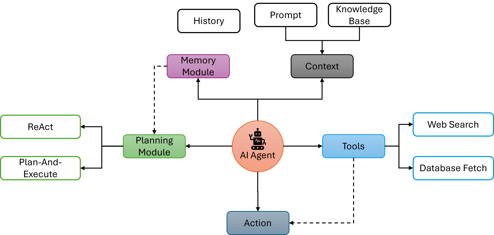
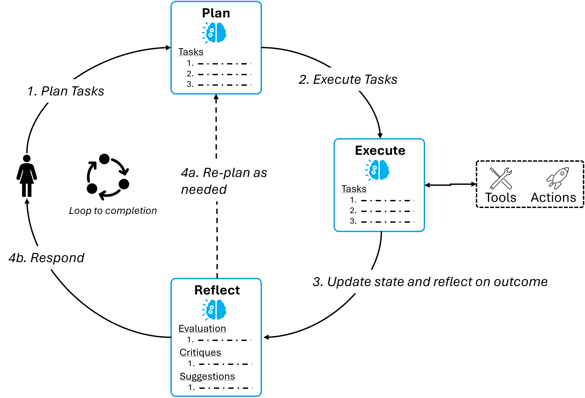

# AI Agents

Language model powered AI agents and state machines have emerged as a promising design pattern for creating flexible and effective ai-powered products. Agents use LLMs as general-purpose problem-solvers, connecting them with external resources to answer questions or accomplish tasks. 

The structure and design pattern of an LLM program is commonly called **cognitive architecture**.

## Agent Architecture

The key components in AI Agentic framework are:

- _Propose action_: the LLM generates text to respond directly to a user or to pass to a function.
- _Execute action_: your code invokes other software to do things like query a database or call an API.
- _Observe_: react to the response of the tool call by either calling another function or responding to the user.

### ReAct Agent

The ReAct agent is a great prototypical design for this, as it prompts the language model using a repeated thought, act, observation loop:

  Thought: I should call Search() to see the current score of the game.
  Act: Search("What is the current score of game X?")
  Observation: The current score is 24-21
  ... (repeat N times)

This takes advantage of _Chain-of-thought prompting to make a single action choice per step_.

### Plan-And-Execute

**Plan-and-Solve** Prompting is a simple planning agent architecture consists of two basic components:

- A **planner**, which prompts an LLM to generate a multi-step plan to complete a large task.
- **Executor(s)**, which accept the user query and a step in the plan and invoke 1 or more tools to complete that task.

Once execution is completed, the agent is called again with a re-planning prompt, letting it decide whether to finish with a response or whether to generate a follow-up plan.

#### References

- https://blog.langchain.dev/planning-agents/
