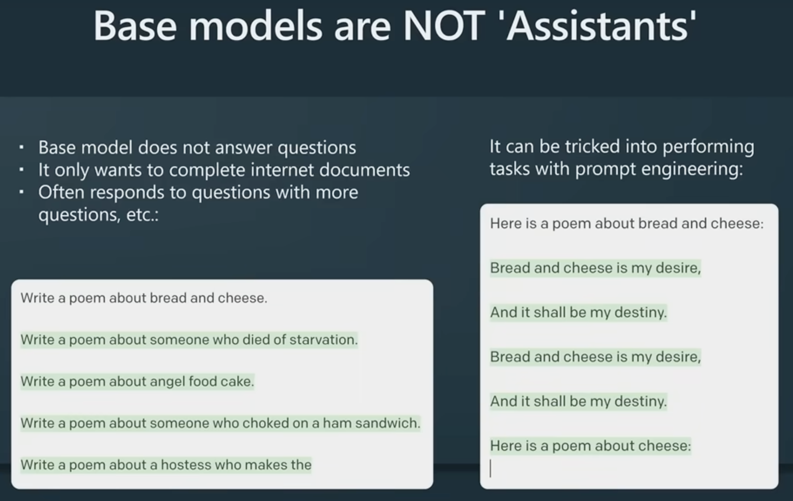

# :brain: Generative AI - Learning Guide :robot:
> "_A.I. might not replace you, but a person who uses A.I. could._"

A curated list of :notebook: tutorials, :tv: videos , :books: articles about Generative AI concepts and core terminology.
  
---

## Generative AI

Generative AI is a type of artificial intelligence technology that can produce various types of content, including text, images, audio, videos and synthetic data.

### What is ChatGPT? 
ChatGPT is a large language model that generates human-like text in response to a given text prompt. It is essentially a next word predictor. 

- ChatGPT is an AI chatbot developed by OpenAI
- ChatGPT is a variant of the GPT (Generative Pre-training Transformer) model, which is a type of transformer-based neural network architecture.
- The model is trained on a [large dataset of text](https://en.wikipedia.org/wiki/GPT-3) which contains entire internet, books, Wikipedia and more.

It can understand what we say or write, or rather, can generate knowledge from what they have learned from humans. It set to revolutionise the way we work.
It is showing sparks of cleverness that can accelerate automation.

### How LLMs (ChatGPT) Work?

- https://jalammar.github.io/illustrated-gpt2/
- [How GPT3 Works - Visualizations and Animations](https://jalammar.github.io/how-gpt3-works-visualizations-animations/)

### How ChatGPT Trained?

- :tv: [State of GPT](https://www.youtube.com/watch?v=bZQun8Y4L2A)
- :tv: [3Blue1Brown - How ChatGPT Works Series?](https://www.youtube.com/watch?v=aircAruvnKk&list=PLZHQObOWTQDNU6R1_67000Dx_ZCJB-3pi)

#### Datasets used to train LLM / ChatGPT

- [Entire Internet Archive](https://commoncrawl.org/)
- [Public Data Sets in the era of LLM’s](https://medium.com/@zolayola/public-data-sets-in-the-era-of-llms-0a4e89bda658)

> **Base Models** - Don't want make answer to your questions, they want to complete documents.

### Training pipeline for a standard LLM

### Want to build your own GPT?

- :tv: [Let's build GPT: from scratch, in code, spelled out](https://youtu.be/kCc8FmEb1nY)
- :tv: [Let's reproduce the GPT-2 (124M) from scratch.](https://www.youtube.com/watch?v=l8pRSuU81PU)

- [nanoMoE: Mixture-of-Experts (MoE) LLMs from Scratch in PyTorch](https://cameronrwolfe.substack.com/p/nano-moe)

---

### What are Reasoning LLMs?

**System 1 Thinking Vs. System 2 Thinking**

System 1 being intuitive, fast, and often automatic.
- walk to our regular bus stop without having to use a map to find it
- ‘know’ that 2 + 2 = 4 without having to think about it.
- Detecting sadness in a voice. 
- Recognizing a friend's face.

System 2 is deliberate, analytical, and effortful. 
- Giving directions to a specific location.
- Doing a crossword puzzle. 
- Writing an essay. 
- Solving a math problem

**Test-time compute** in Large Language Models (LLMs) refers to the computational resources dedicated during the inference (or prediction) phase, not during training. It's about giving the model more "thinking time" to refine its reasoning and arrive at a more accurate answer, often through techniques like chain-of-thought reasoning traces.

- [Demystifying Reasoning Models](https://cameronrwolfe.substack.com/p/demystifying-reasoning-models)

## Tokenization

Tokenization is the process of breaking down text into smaller units called tokens. Tokens are the smallest individual units of a language model, and can correspond to words, subwords, characters, or even bytes (in the case of Unicode)

LLMs use tokenization to break down text into tokens, assign each token a numerical representation (index), and then use these numerical representations as input for the model.

#### Online Tokenizers

- https://tiktokenizer.vercel.app/
- https://tokens-lpj6s2duga-ew.a.run.app/

The set of **all unique tokens** that an LLM uses is called its **vocabulary**.

### Why LLMs fail to do simple math?

https://platform.openai.com/tokenizer

**Why LLMs fail to calculate 92374 x 2984 ?**

To an LLM, the number "92374" is _not a mathematical value_. It's a **string of text**, a token, just like the word "apple" or "philosophy". The model knows that the sequence of characters "2+2=" is very, very likely to be followed by the character "4" because it has seen this pattern billions of times in its training data.

However, for a novel problem like 92374 x 2984, it has almost certainly never seen this exact sequence before. It tries to "predict" the answer by drawing on patterns from other multiplication problems it has seen. This is like trying to guess the ending of a new book by combining the endings of other books you've read. The result might look plausible, but it's very likely to be wrong.

It lacks an "Internal Scratchpad" or Algorithm.

### Tokenization Algorithms

There are various tokenization algorithms used by LLMs including,
- Byte Pair Encoding (BPE)
- Unigram tokenization
- WordPiece tokenization. 

### How images & Videos are tokenized?

### Context Window

The “context window” refers to the entirety of the amount of text a language model can look back on and reference when generating new text plus the new text it generates. 

Context window (also called "token limit") limitation.

- GPT-4 has a token limit of 8,192, with another variant increased to 32,768
- Claude Opous has context window (200,000 tokens) represents the maximum capacity for storing conversation history and generating new output from Claude.

## Word / Text Embeddings

**What is Word Embedding?**

In the context of large language models, **embeddings represent text as a dense vector of numbers to capture the meaning of words**. They map the semantic meaning of words together or similar features into vectors. These embeddings can then be used for search engines, recommendation systems, and generative AIs such as ChatGPT.

**What is a vector?**

A vector is an array of numbers like [0, 1, 2, 3, 4, … ]. Vector can represent more complex objects such as words, sentences, images, and audio files in an embedding.

[A Beginner’s Guide to Tokens, Vectors, and Embeddings in NLP](https://medium.com/@saschametzger/what-are-tokens-vectors-and-embeddings-how-do-you-create-them-e2a3e698e037)

https://www.youtube.com/shorts/FJtFZwbvkI4

#### LLM Playground Settings

**Temperature** - LLMs are non-deterministic by design, temparature setting can tweak their behaviour. Lower temperature makes model more deterministic, results pick highest probable next token. Increasing temperature could lead to more randomness encouraging more diverse or creative outputs.

Refer to, [Demystifying the Temperature Parameter: A Visual Guide to Understanding its Role in Large Language Models](https://ai.plainenglish.io/understanding-llama2-kv-cache-grouped-query-attention-rotary-embedding-and-more-c17e5f49a6d7)

**Top-K, Top-p Sampling** - LLM takes in an input sequence of tokens and then tries to predict the next token, by generating a discrete probability distribution over all possible tokens. 
- [Top-K sampling](https://peterchng.com/blog/2023/05/02/token-selection-strategies-top-k-top-p-and-temperature/)
- [Top-p sampling](https://peterchng.com/blog/2023/05/02/token-selection-strategies-top-k-top-p-and-temperature/)

Top-K and Top-p operate directly on the output probabilities.

### Gen AI Tools

#### Text to Image 

[Midjourney](https://www.midjourney.com/showcase/recent/) is a text-to-image AI that generates visually appealing images based on text prompts.
- [Midjourney + ChatGPT-4 = INSANE Prompts and Images](https://www.youtube.com/watch?v=Asg1e_IYzR8)
- [DALL-E 2](https://openai.com/dall-e-2)

### Text to Video Generators

- [Google Veo 3](https://www.imagine.art/features/veo-3)
- [Runway ML](https://www.imagine.art/dashboard/video)

### Audio
#### Speech Recognition & Transcription (Audio-to-Text)
- [Whishper - Automated Speech Recognition](https://openai.com/research/whisper)
#### Speech Synthesis (Text-to-Audio)

#### Voice Cloning

- [Eleven Labs](https://elevenlabs.io/)

### Gen AI Youtube Channels
- :tv: [Youtube @AllaboutAI Channel](https://www.youtube.com/@AllAboutAI/videos) 🌟
- :tv: [Youtube @mreflow Channel](https://www.youtube.com/@mreflow/videos) 🌠

## Generative AI / LLMs Model Hub 
[Huggingface](https://huggingface.co/) - A repository of open-source and proprietary LLM model hub. Provides LLM models, hosting, inference endpoints and more.

[Hugging Face Transformer Tutorial](https://huggingface.co/learn/nlp-course/chapter2/1?fw=pt) - A library to download open-source LLMs to your machine, run LLMs locally and perform inferences.
#### LLM Leaderboards

https://lmarena.ai/leaderboard

